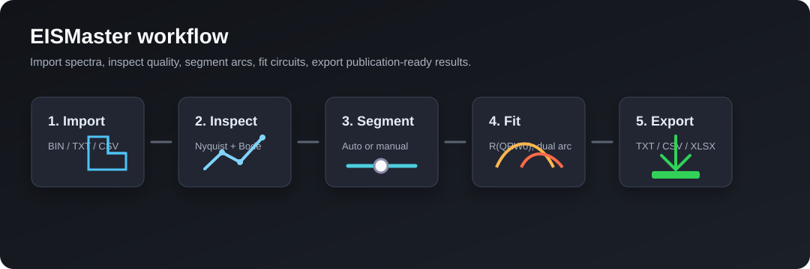
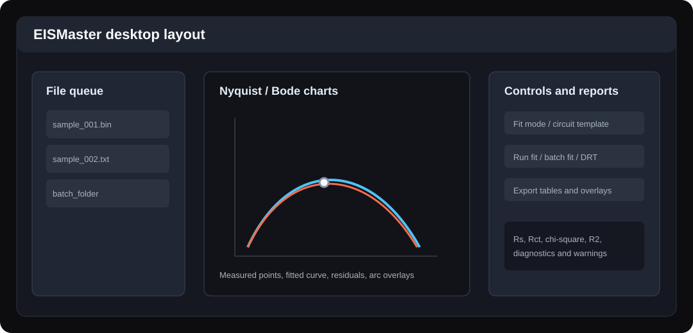
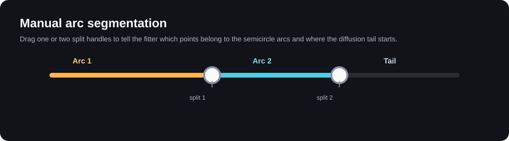

# EISMaster

EISMaster 是一个面向电化学阻抗谱（Electrochemical Impedance Spectroscopy, EIS）的桌面分析工具。它把 CHI660F/CH Instruments 数据读取、谱图检查、半圆分段、等效电路拟合、批量处理、DRT 分析和结果导出集中在一个 PySide6 图形界面里，适合电池、电极材料、腐蚀、界面动力学等实验数据的快速整理和发布前分析。



## 主要能力

- **多格式导入**：支持 CHI660F `.bin`、CH Instruments `.txt` 和通用 `.csv` 阻抗数据。
- **谱图检查**：自动生成 Nyquist、Bode 模值、Bode 相位图，并显示原始数据表。
- **质量评估**：提供 KK 检查、噪声估计、异常点提示和拟合失败诊断。
- **等效电路拟合**：内置单半圆 `R(Q(RWo))` 和双半圆 `R(QR)(Q(RWo))` 模型。
- **手动/自动分段**：可用 Auto 识别，也可以拖动分界滑块指定半圆和低频尾部范围。
- **批量拟合**：可对文件夹中的 operando EIS 数据自动分段、拟合并汇总参数趋势。
- **DRT 集成**：可调用 MATLAB DRTtools，支持标准 Tikhonov、贝叶斯置信区间、BHT 和峰拟合分析流程。
- **发布型导出**：导出拟合报告、原始图表数据、拟合叠加曲线、Rs/Rct 摘要和 XLSX 批量汇总表。



## 安装和运行

### 1. 克隆项目

```powershell
git clone https://github.com/Jakiewbe/EISMaster.git
cd EISMaster
```

### 2. 准备 Python 环境

项目要求 Python 3.11 或更新版本。Windows 推荐使用 Conda 或 venv：

```powershell
python -m venv .venv
.\.venv\Scripts\activate
python -m pip install --upgrade pip
```

### 3. 安装依赖

普通安装：

```powershell
pip install -e .
```

带 `pyimpspec` 初值估计的高级安装：

```powershell
pip install -e ".[advanced]"
```

### 4. 启动软件

```powershell
python -m eismaster
```

也可以使用项目里的启动脚本：

```powershell
python launch_eismaster.py
```

## 快速上手

### 第一步：导入数据

打开软件后，在主窗口中选择单个文件或数据文件夹。EISMaster 会根据扩展名和文件内容自动判断读取方式：

| 文件类型 | 扩展名 | 典型来源 | 说明 |
| --- | --- | --- | --- |
| CHI660F 二进制 | `.bin` | CHI A.C. Impedance 实验 | 自动识别尾部二进制记录，兼容记录数异常的文件 |
| CH Instruments 文本 | `.txt` | CHI 软件导出 | 读取频率、实部、虚部、模值和相位 |
| 通用表格 | `.csv` | 其他软件或自定义处理 | 需要包含频率、`Zreal`、`Zimag` 等等价列 |

导入后，左侧队列会列出所有谱图。点击某个样品名即可切换当前分析对象。

### 第二步：检查谱图和数据质量

在检查页中查看 Nyquist 图、Bode 模值图、Bode 相位图和原始数据表。建议先确认三件事：

1. 频率是否从高到低或低到高排列清楚。
2. Nyquist 图是否存在明显反号、突跳或极端异常点。
3. 高频截距和低频尾部是否符合实验预期。

如果数据质量提示中出现异常点或 KK 检查警告，应先回到原始实验文件确认是否有测试中断、夹具接触不稳或导出格式错误。

### 第三步：选择拟合模式

拟合页提供三种模式：

| 模式 | 适用情况 | 操作方式 |
| --- | --- | --- |
| `Single-arc R(QRWo)` | 一个主要半圆加低频扩散尾 | 拖动一个分界点，指定半圆结束位置 |
| `Double-arc R(QR)(Q(RWo))` | 高频膜阻抗和中低频电荷转移两个半圆 | 拖动两个分界点，划分半圆 1、半圆 2 和尾部 |
| `Auto 识别` | 批量初筛或半圆边界较清楚的数据 | 软件自动识别半圆数量和分界点 |



分界点不是简单裁剪数据，而是给拟合器提供“半圆区域”的先验信息。低频尾部仍会保留在模型拟合中，用于 Warburg 元件相关参数。

### 第四步：运行拟合并阅读结果

点击开始拟合后，计算会在后台线程中执行，界面不会卡死。完成后重点查看：

- `Rs`：高频截距或溶液/欧姆阻抗。
- `Rct`：电荷转移相关阻抗，通常用于比较反应动力学。
- `Rsei`：双半圆模型中的膜阻抗或表面层阻抗。
- `CPE_T` / `CPE_P`、`Q1` / `n1`、`Q2` / `n2`：非理想电容元件参数。
- `Wo_R`、`Wo_T`、`Wo_P`：有限长度 Warburg 元件参数。
- `R2`、残差和诊断信息：用于判断拟合是否可信。

如果拟合曲线偏离明显，优先调整分界点，然后再考虑换模型。单半圆数据强行使用双半圆模型，或者双半圆数据只用单半圆模型，都会导致参数互相补偿。

## 批量分析流程

批量页适用于 operando EIS、循环中定期采样、不同电位/温度/时间点的系列数据。

1. 选择包含 EIS 文件的文件夹。
2. 确认队列中每个文件都能正确解析。
3. 选择拟合模式，常规批量建议先用 `Auto 识别`。
4. 点击批量拟合。
5. 检查汇总表中的 `Rs`、`Rct`、`Rsei`、拟合误差和诊断列。
6. 导出 XLSX 或 TXT，用于后续绘图和统计。

批量结果不是“盲信”的最终结论。建议抽查头、中、尾几个谱图的拟合叠加图，确认自动分段没有把噪声或扩散尾误识别为半圆。

## DRT 分析

EISMaster 可以把谱图整理成 MATLAB DRTtools 可读取的输入，并调用本地 MATLAB 运行 DRT 分析。

### 需要准备

- 已安装 MATLAB。
- 已下载 DRTtools，并能在 MATLAB 中正常运行。
- 在软件中填写 MATLAB 可执行文件路径和 DRTtools 目录。

### 方法选择

| 选项 | 说明 |
| --- | --- |
| 标准法（Tikhonov） | 常规 DRT 反演，适合快速比较峰位和峰强 |
| 贝叶斯置信区间 | 输出不确定性信息，适合需要可信区间的结果 |
| BHT（贝叶斯分层） | 更完整的贝叶斯层级模型流程 |
| 峰拟合分析 | 在标准 DRT 曲线基础上提取峰参数 |

DRT 对噪声和频率覆盖范围很敏感。若低频点不足或相位噪声很高，DRT 峰可能会出现假峰，建议结合原始 Nyquist/Bode 图一起判断。

## 导出文件说明

单个谱图导出通常会生成：

| 文件 | 内容 |
| --- | --- |
| `*_fit_report.txt` 或 `.csv` | 拟合模型、参数、误差、诊断信息 |
| `*_raw_plot.txt` 或 `.csv` | 原始频率、实部、虚部、模值、相位 |
| `*_fit_overlay.txt` 或 `.csv` | 原始曲线与拟合曲线叠加数据 |
| `*_rs_rct.txt` 或 `.csv` | 常用阻抗参数摘要 |
| `.xlsx` | 批量汇总表或多 sheet 导出 |

这些文本文件可以直接导入 Origin、Excel、Python、MATLAB 或其他绘图软件。

## 等效电路模型

### 单半圆：`R(Q(RWo))`

适合一个主导电荷转移半圆和低频扩散尾的数据。

```text
      +--- CPE ------+
Rs ---+              +---
      +--- Rct - Wo -+
```

主要参数：`Rs`、`CPE_T`、`CPE_P`、`Rct`、`Wo_R`、`Wo_T`、`Wo_P`。

### 双半圆：`R(QR)(Q(RWo))`

适合具有高频表面膜过程和中低频电荷转移过程的数据。

```text
      +--- Rsei ----+   +--- Rct ---- Wo ----+
Rs ---+             +---+                    +---
      +--- Q1 ------+   +--- Q2 -------------+
     high-frequency      mid/low-frequency
     surface film        charge transfer
```

主要参数：`Rs`、`Q1`、`n1`、`Rsei`、`Q2`、`n2`、`Rct`、`Wo_R`、`Wo_T`、`Wo_P`。

## 发布包生成

Windows 发布包使用 PyInstaller 生成。推荐在 Python 3.11 环境中执行：

```powershell
python -m pip install pyinstaller
python -m PyInstaller --noconfirm --clean EISMaster.spec
```

构建完成后，主程序位于：

```text
dist/EISMaster/EISMaster.exe
```

发布前建议把整个 `dist/EISMaster` 文件夹压缩为 zip，并记录 SHA256：

```powershell
Compress-Archive -Path dist\EISMaster -DestinationPath dist\EISMaster-v0.1.0-windows-x64.zip -Force
Get-FileHash dist\EISMaster-v0.1.0-windows-x64.zip -Algorithm SHA256
```

发布到 GitHub Release 时，上传 zip 文件即可。`dist/` 是构建产物目录，默认不会提交到 Git 仓库。

## 项目结构

```text
src/eismaster/
  app.py                  # GUI 入口
  models.py               # SpectrumData、FitOutcome 等数据结构
  exporters.py            # TXT / CSV / XLSX 导出
  matlab_drt.py           # MATLAB DRTtools 集成
  io/
    chi.py                # CHI .bin / .txt / .csv 解析
  analysis/
    fitting.py            # 等效电路拟合主逻辑
    segmentation.py       # 自动/手动半圆分段
    batch.py              # 批量拟合
    circuits.py           # 电路模板定义
    diagnostics.py        # 拟合诊断
    native_drt.py         # 原生 DRT 计算
    preprocessing.py      # 数据清洗和预处理
    quality.py            # 质量评估
  ui/
    main_window.py        # 主窗口
    split_slider.py       # 单/双分界点滑块
    segment_overlay.py    # Nyquist 分段覆盖层
    range_slider.py       # 通用范围滑块
    theme.py              # 深色主题
    circuit_builder/      # 等效电路编辑组件
tests/                    # 单元测试和回归测试
docs/images/              # README 示意图
```

## 开发和测试

运行全部测试：

```powershell
python -m pytest
```

运行解析器相关测试：

```powershell
python -m pytest tests/test_parsers.py
```

运行 UI smoke 测试：

```powershell
python -m pytest tests/test_ui_smoke.py
```

## 常见问题

### `.bin` 和 `.txt` 同一个样品点数不一致怎么办？

优先确认 `.bin` 是否来自 CHI A.C. Impedance 测试。EISMaster 会尝试从文件尾部识别真实二进制记录段，以处理文件头记录数不可靠的情况。如果仍不一致，请用 `.txt` 结果作为人工校验基准。

### 拟合参数看起来不合理怎么办？

先检查谱图和分界点，再检查模型选择。半圆边界错误会直接影响 `Rct`、`Rsei` 和 CPE 参数。必要时用单半圆和双半圆分别试算，对比残差和参数稳定性。

### 为什么 DRT 结果有多个小峰？

DRT 反演对噪声、频率范围和正则化参数敏感。小峰可能是真实过程，也可能是噪声放大。建议结合 Bode 相位、Nyquist 残差和重复实验判断。

### 发布包打开失败怎么办？

先在命令行中运行 `dist\EISMaster\EISMaster.exe` 观察错误信息。常见原因包括缺少 Qt 插件、MATLAB/DRTtools 路径不可用、或者构建环境依赖不完整。

## License

MIT
