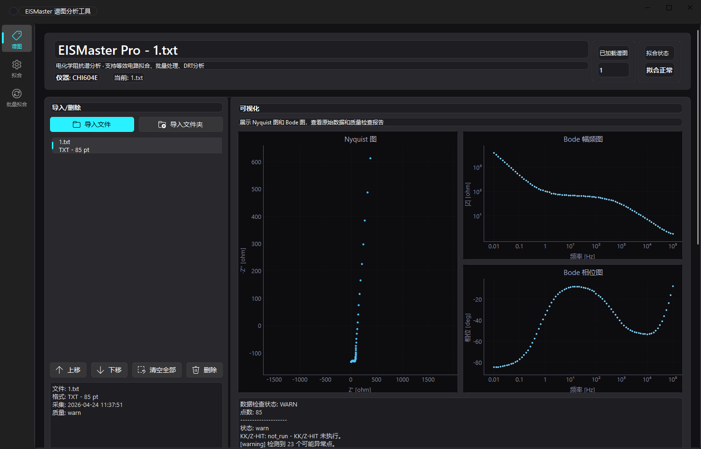
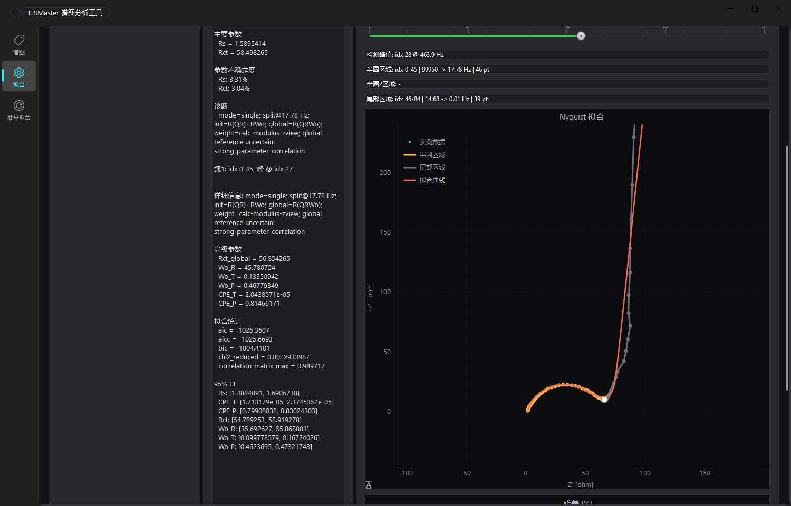
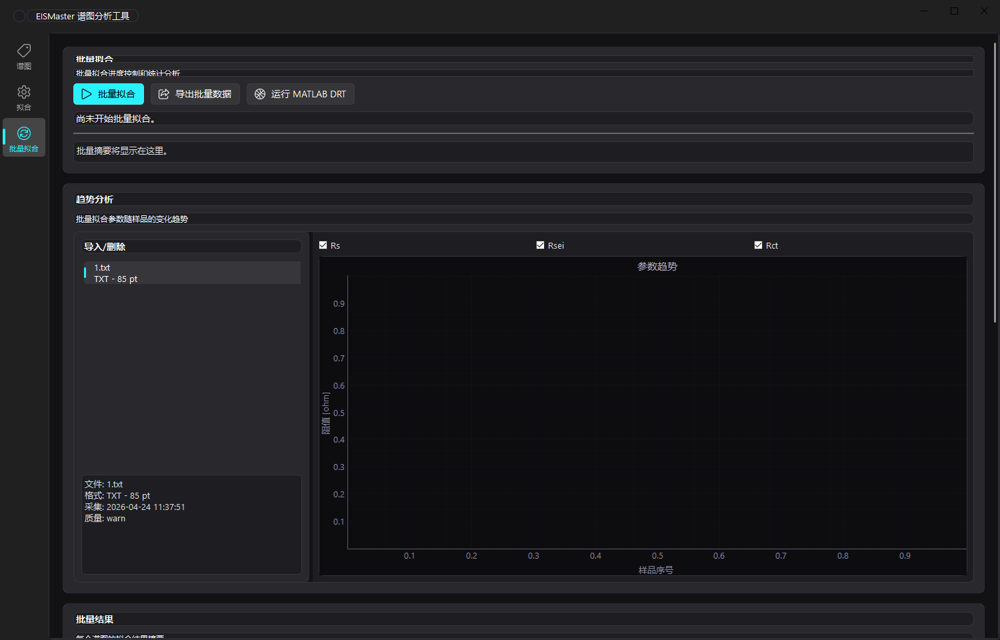
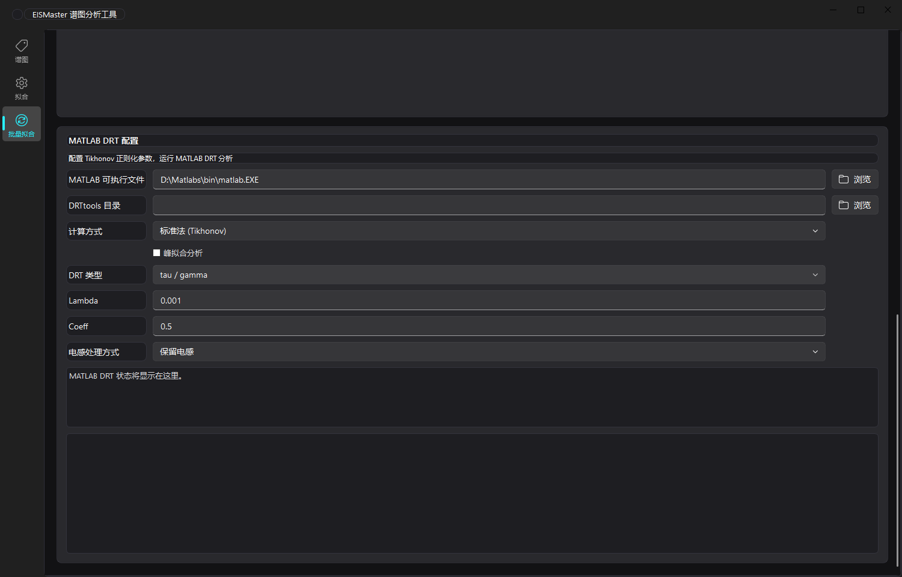

# EISMaster Pro 谱图分析工具

EISMaster Pro 是一个面向电化学阻抗谱（Electrochemical Impedance Spectroscopy, EIS）的桌面分析软件。它的核心目标很直接：把辰华电化学工作站导出的阻抗数据直接读进来，在同一个界面里完成谱图查看、质量检查、等效电路拟合、批量拟合、趋势分析和 MATLAB DRT 分析。

软件特别强化了辰华数据的兼容性：**支持辰华 `.bin` 二进制文件直接处理**，也支持辰华/CHI 软件导出的 **`.txt` 文本文件**。对经常处理 CHI604E、CHI660E、CHI660F 等仪器数据的用户来说，不需要先手动转表、改列名或复制到模板里，可以直接导入文件开始分析。

## 你能用它做什么

| 能力 | 说明 |
| --- | --- |
| 辰华 `.bin` 直读 | 直接解析辰华阻抗二进制文件，自动提取频率、实部、虚部等阻抗数据 |
| `.txt` 文件导入 | 支持 CHI 软件导出的文本阻抗文件，保留仪器、采集时间、点数等信息 |
| 谱图可视化 | 自动绘制 Nyquist 图、Bode 幅频图、Bode 相位图 |
| 数据质量检查 | 显示点数、质量状态、KK/Z-HIT 状态和可能异常点 |
| 单谱图拟合 | 支持单弧和双弧等效电路模型，输出 Rs、Rct、Rsei、CPE、Warburg 参数 |
| 分界点控制 | 拟合页提供半圆/尾部区域分界滑条，可手动调整拟合先验 |
| 批量拟合 | 对一组谱图批量拟合，生成参数趋势和批量摘要 |
| MATLAB DRT | 可配置 MATLAB 与 DRTtools，运行 Tikhonov、BHT、峰拟合等 DRT 分析 |
| 结果导出 | 支持拟合报告、叠加曲线、原始绘图数据、Rs/Rct 摘要和批量表格导出 |

## 界面导读

EISMaster Pro 的主界面分成三个主要工作页：**谱图**、**拟合**、**批量拟合**。左侧是导航栏，中间是当前工作区。实际工作时通常按这个顺序走：

```text
导入 bin/txt 文件 -> 查看 Nyquist/Bode -> 检查质量状态
                 -> 调整分界点 -> 运行等效电路拟合
                 -> 批量拟合/趋势分析 -> MATLAB DRT 或导出结果
```

### 1. 谱图页：导入文件并检查原始谱图



谱图页用于导入和查看原始 EIS 数据。左侧是文件队列，右侧是可视化区域。导入文件后，软件会显示：

- 文件名，例如 `1.txt`
- 文件格式和点数，例如 `TXT - 85 pt`
- 仪器信息，例如 `CHI604E`
- 当前质量状态，例如 `warn`
- Nyquist 图
- Bode 幅频图
- Bode 相位图
- 数据检查状态和异常点提示

这个页面适合做第一轮判断：文件有没有读对、点数是否正常、阻抗虚部方向是否合理、Bode 曲线是否连续、低频端是否有明显噪声或漂移。

**辰华文件支持是这个页面的重点。** 对 `.bin` 文件，EISMaster 会尝试直接解析二进制记录，不要求用户先在 CHI 软件里另存为文本；对 `.txt` 文件，软件会读取 CHI 导出的频率、阻抗实部、阻抗虚部、模值、相位等列，并保留采集时间和仪器信息。

### 2. 拟合页：单谱图等效电路拟合



拟合页左侧仍然是导入队列，中间显示拟合结果，右侧显示拟合曲线。软件会输出：

- 当前模型，例如 `single-arc R(QRWo)`
- 拟合状态，例如 `OK`
- 主要参数：`Rs`、`Rct`
- 双弧模型参数：`Rsei`、`Rct`
- 参数不确定度
- 诊断信息
- 高级参数：`Wo_R`、`Wo_T`、`Wo_P`、`CPE_T`、`CPE_P`
- 拟合统计：`aic`、`aicc`、`bic`、`chi2_reduced` 等
- 置信区间和相关性提示

右侧的拟合图会同时显示实测数据、半圆区域、尾部区域和拟合曲线。顶部的分界滑条用于控制半圆和低频尾部的划分。

常见操作方式：

1. 在左侧选择一个谱图。
2. 选择单弧或双弧模型。
3. 根据 Nyquist 图拖动分界点。
4. 点击拟合。
5. 查看 `Rs`、`Rct`、残差、参数不确定度和诊断提示。

分界点不是简单删点。它的作用是告诉拟合器：哪一段更像半圆，哪一段更像扩散尾部。对于半圆不完整、低频拖尾明显或者异常点较多的数据，手动分界通常比完全自动拟合更稳定。

## 支持的数据格式

| 格式 | 扩展名 | 推荐使用场景 | 说明 |
| --- | --- | --- | --- |
| 辰华二进制阻抗文件 | `.bin` | 从 CHI/辰华软件获得的原始阻抗文件 | 可直接导入，不需要先转 TXT |
| 辰华文本导出文件 | `.txt` | CHI 软件导出的 A.C. Impedance 文本数据 | 自动读取频率、实部、虚部、模值、相位 |
| 通用表格文件 | `.csv` | 其他软件或自定义整理后的阻抗数据 | 需要包含频率、Z real、Z imag 等等价列 |

`.bin` 直读适合保留原始数据链路；`.txt` 适合与 CHI 软件导出结果核对。若同一样品同时有 `.bin` 和 `.txt`，可以分别导入做交叉验证。

## 拟合模型

### 单弧模型：`R(Q(RWo))`

适用于只有一个主要半圆，同时低频端带扩散尾部的谱图。

```text
      +--- CPE ------+
Rs ---+              +---
      +--- Rct - Wo -+
```

主要输出：

- `Rs`：欧姆阻抗/溶液阻抗/高频截距
- `Rct`：电荷转移阻抗
- `CPE_T`、`CPE_P`：非理想电容参数
- `Wo_R`、`Wo_T`、`Wo_P`：有限长度 Warburg 参数

### 双弧模型：`R(QR)(Q(RWo))`

适用于高频和中低频存在两个过程的谱图，例如表面膜过程加电荷转移过程。

```text
      +--- Rsei ----+   +--- Rct ---- Wo ----+
Rs ---+             +---+                    +---
      +--- Q1 ------+   +--- Q2 -------------+
```

主要输出：

- `Rs`：欧姆阻抗
- `Rsei`：膜阻抗或高频界面阻抗
- `Rct`：电荷转移阻抗
- `Q1/n1`、`Q2/n2`：两个 CPE 支路参数
- `Wo_R`、`Wo_T`、`Wo_P`：扩散相关参数

## 批量拟合和趋势分析



批量拟合页用于处理一组 EIS 文件，例如 operando 测试、循环过程测试、不同温度或不同 SOC 条件下的连续谱图。

界面上方提供：

- `批量拟合`
- `导出批量数据`
- `运行 MATLAB DRT`

趋势分析区域可以勾选：

- `Rs`
- `Rsei`
- `Rct`

软件会把每个谱图的拟合参数按样品序号绘制成趋势图，便于快速观察阻抗随时间、循环或工况的变化。批量结果区域会汇总每个谱图的拟合结果和诊断信息。

建议流程：

1. 导入一个文件夹或多个谱图文件。
2. 先在谱图页抽查头、中、尾几个文件。
3. 在拟合页确认模型和分界策略。
4. 回到批量拟合页运行批量拟合。
5. 检查 `Rs/Rsei/Rct` 趋势是否连续。
6. 导出批量表格用于 Origin、Excel、Python 或论文绘图。

## MATLAB DRT 分析



批量拟合页面下方包含 MATLAB DRT 配置区。需要填写：

- MATLAB 可执行文件路径，例如 `D:\Matlabs\bin\matlab.EXE`
- DRTtools 目录
- 计算方式
- DRT 类型
- Lambda
- Coeff
- 电感处理方式

支持的计算方式包括：

| 计算方式 | 用途 |
| --- | --- |
| 标准法（Tikhonov） | 常规 DRT 反演，适合快速查看弛豫峰 |
| 贝叶斯置信区间 | 输出不确定性信息，适合更严格的结果判断 |
| BHT | 贝叶斯分层 DRT 分析 |
| 峰拟合分析 | 对 DRT 峰进行进一步提取和拟合 |

DRT 对噪声和频率范围很敏感。建议先确认 Nyquist/Bode 曲线质量，再运行 DRT；如果低频点漂移明显，DRT 结果需要谨慎解释。

### DRTtools 来源声明

Release 包中随附的 `matlab-DRTtools-local` 脚本来自 ciuccislab 的开源项目 DRTtools：

```text
https://github.com/ciuccislab/DRTtools
```

DRTtools 使用 MIT License。EISMaster Pro 仅对它进行本地调用和流程集成，版权归原项目作者所有；Release 包内保留其原始 `LICENSE` 和 `README.md`。

## 安装和运行

### 从源码运行

```powershell
git clone https://github.com/Jakiewbe/EISMaster.git
cd EISMaster
python -m venv .venv
.\.venv\Scripts\activate
python -m pip install --upgrade pip
pip install -e .
python -m eismaster
```

如果需要高级初值估计：

```powershell
pip install -e ".[advanced]"
```

### 使用 Release 包

下载 Windows Release zip 后解压，运行：

```text
EISMaster.exe
```

使用 Release 包时不需要自己安装 Python 依赖。MATLAB DRT 功能仍然需要本机已经安装 MATLAB，并正确配置 DRTtools 目录。

Release 解压后会包含：

```text
EISMaster.exe
matlab-DRTtools-local/
THIRD_PARTY_NOTICES.md
```

其中 `matlab-DRTtools-local/` 为随包附带的 DRTtools 脚本目录，来源见上面的 DRTtools 来源声明。

## 导出结果

常见导出文件包括：

| 文件 | 内容 |
| --- | --- |
| `*_fit_report.txt` / `.csv` | 拟合模型、参数、统计量、诊断信息 |
| `*_fit_overlay.txt` / `.csv` | 实测曲线和拟合曲线叠加数据 |
| `*_raw_plot.txt` / `.csv` | 原始 Nyquist/Bode 绘图数据 |
| `*_rs_rct.txt` / `.csv` | 常用参数摘要 |
| `.xlsx` | 批量拟合汇总表 |

这些文件可以直接用于 Origin、Excel、MATLAB 或 Python 后处理。

## 适合的使用场景

- 辰华 CHI 工作站 EIS 数据快速查看
- `.bin` 原始阻抗文件直接解析
- `.txt` 导出文件批量整理
- 电池材料、界面阻抗、腐蚀、电极过程分析
- 单谱图等效电路拟合
- operando EIS 批量拟合和趋势追踪
- DRTtools 流程整理和 MATLAB DRT 批量运行
- 论文或组会前的阻抗参数导出

## 拟合算法详解

### 算法概述

EISMaster 的底层拟合采用 **复合非线性最小二乘法（CNLS）**，实现了一个自定义的 ZView 风格分段式拟合器。核心代码位于 `src/eismaster/analysis/fitting.py`。

### 拟合流程

整个拟合过程分为三个阶段：**分段检测 → 分段初始拟合 → 全局精炼**。

#### 1. 分段检测

在 Nyquist 图上自动识别半圆与扩散尾部的分界点，也支持手动拖动分界滑条覆盖。

```text
频率轴:  高频 ─────────────────────────────── 低频
         Rs ●═══ Rct 半圆 ═══● ═══ Warburg 尾部 ═══→
                         ↑
                      分界点
```

检测算法会寻找 `-Z''` 的峰值位置和曲率突变点，将谱图划分为：

- **弧区（Arc Region）**：高频半圆，主要对应 Rs 和 Rct
- **尾区（Tail Region）**：低频扩散尾部，对应 Warburg 元件

#### 2. 分段初始拟合

对弧区和尾区分别独立拟合，得到可靠的初始参数：

| 区域 | 等效电路 | 用途 |
|------|----------|------|
| 弧区 | `R(QR)` | 提取 Rs、Rct、CPE 初始值 |
| 尾区 | `RWo` | 提取 Warburg 初始值（R、τ、n） |

分段拟合使用 pyimpspec 作为后端，可选择 least_squares、L-BFGS-B、Powell 等优化方法，并对每种权重策略进行尝试。

#### 3. 全局精炼

将分段拟合的参数作为种子，对完整频谱进行 CNLS 全局优化：

```python
# 单弧模型参数
x = [Rs, CPE_T, CPE_P, Rct, Wo_R, Wo_T, Wo_P]

# 双弧模型参数
x = [Rs, Q1, n1, Rsei, Q2, n2, Rct, Wo_R, Wo_T, Wo_P]
```

使用 scipy.optimize.least_squares 的 TRF（信赖域反射）算法，支持以下权重策略：

| 权重名 | 公式 | 特点 |
|--------|------|------|
| `calc-modulus` | σ = \|Z_model\| | 对模型残差加权 |
| `calc-proportional` | σ = max(\|Z_exp\|, floor) | 对实测值加权 |
| `calc-unit` | σ = 1 | 等权 |
| `data-special` | σ = 局部噪声估计 | 基于滑窗中位数 |

### 多起点策略

为避免陷入局部极小，拟合器采用多起点试探：

```python
SEED_FACTORS = (1.0, 0.55, 1.8, 0.3, 3.0, 0.1, 5.0)
```

每个初始猜测会与上述因子相乘，生成多个候选起点。对每个起点，再尝试不同权重和优化方法的组合，选取 AICc（修正赤池信息量准则）最低的结果。

### DRT 引导的初始值

拟合器支持通过原生 DRT 计算得到更可靠的初始值：

1. 先对谱图做 DRT 反演
2. 从 DRT 峰中提取弛豫时间 τ、电阻 R、CPE 指数 n
3. 将这些值作为初始猜测注入

### 降级机制

如果全局 CNLS 不收敛，拟合器会自动降级：

| 触发条件 | 降级结果 |
|----------|----------|
| 尾区点数不足 | 使用直接全局拟合（不分段） |
| 分段初始拟合失败 | 使用几何估计或 DRT 引导 |
| 全局精炼失败 | 降级为半圆 R(QR) 结果 |

### 不确定度与诊断

拟合完成后会计算：

- **参数标准误**：基于 Jacobian 矩阵的 SVD 分解
- **95% 置信区间**：±1.96σ
- **相关矩阵**：检测参数间强相关（阈值 > 0.9 告警）
- **AIC/BIC/AICc**：模型选择准则
- **pseudo-χ²**：归一化残差平方和

## 开发者信息

项目结构：

```text
src/eismaster/
  app.py                  # 程序入口
  models.py               # 谱图和拟合结果数据结构
  exporters.py            # TXT / CSV / XLSX 导出
  matlab_drt.py           # MATLAB DRTtools 集成
  io/chi.py               # 辰华 bin/txt/csv 解析
  analysis/
    fitting.py            # 等效电路拟合
    fitting_math.py       # 拟合数学辅助函数
    segmentation.py       # 自动/手动半圆分段
    batch.py              # 批量拟合
    quality.py            # 数据质量检查
    native_drt.py         # 原生 DRT 相关工具
  ui/
    main_window.py        # 主窗口
    state.py               # 应用状态
    workers.py             # 后台任务
    presenters.py          # 状态文案和展示格式化
    split_slider.py       # 分界点滑条
    segment_overlay.py    # 拟合图分段覆盖层
tests/                    # 单元测试和回归测试
```

项目还保留了 `rewrite/` 目录，用于 Rust/Tauri 实现的功能对照和后续评估。目前 Python/PySide6 仍是正式主线，Rust/Tauri 暂不作为等价替代。

运行测试：

```powershell
py -3.11 -m venv .venv
.\.venv\Scripts\python.exe -m pip install -e ".[dev,advanced]"
.\.venv\Scripts\python.exe -m pytest
```

当前回归测试共 80 个，覆盖数据解析、质量检查、分段、拟合、批处理、DRT、导出、UI 状态和打包资源校验。

## License

MIT
